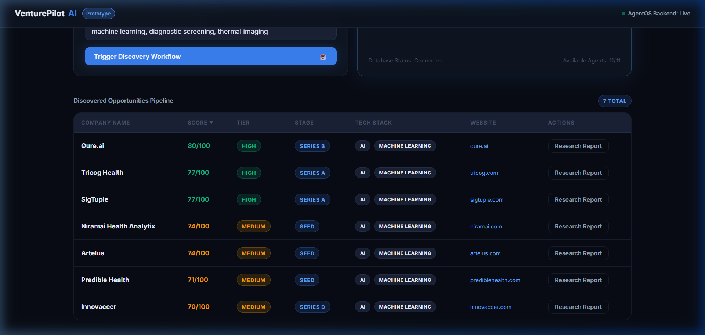
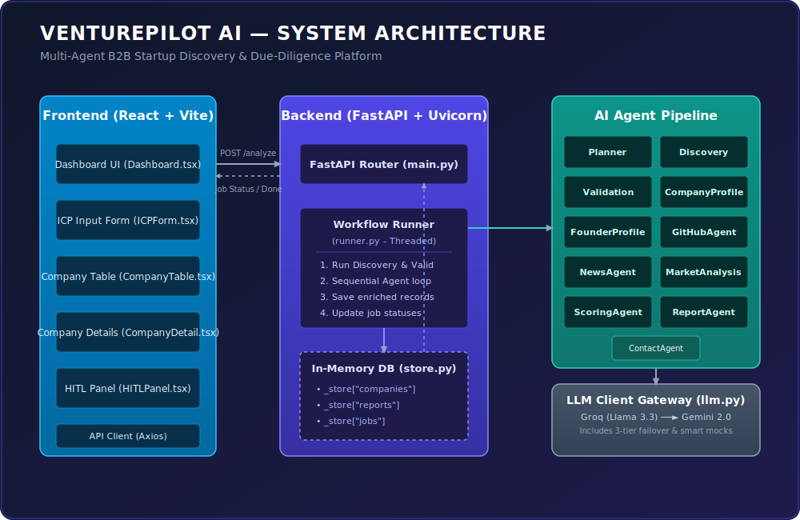
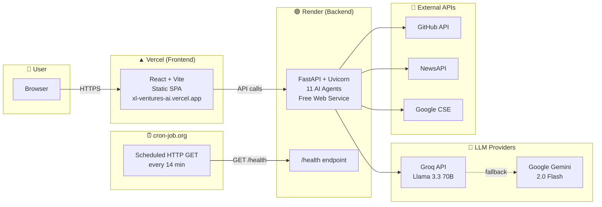
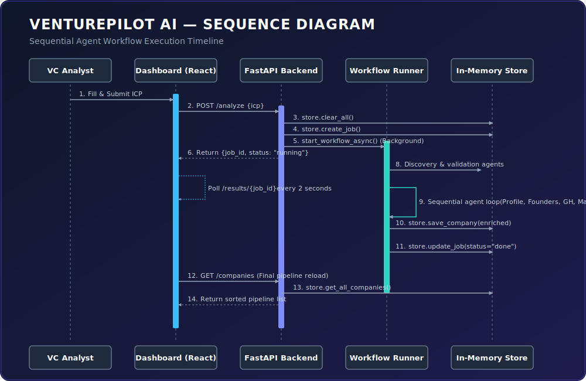
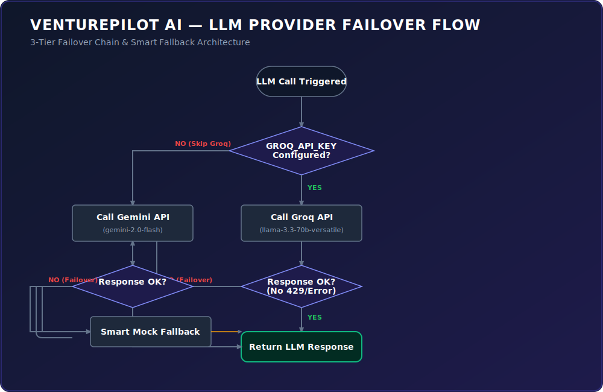

# 🚀 VenturePilot AI

> **Autonomous Multi-Agent VC Analyst & due-diligence pipeline** powered by Groq and Google Gemini.

VenturePilot AI is an enterprise-grade prototype designed for Venture Capital analysts to automate B2B startup discovery, profile enrichment, technical analysis, news sentiment monitoring, scoring, and investment memo generation.

Submit an Ideal Customer Profile (ICP) (e.g., *“AI Healthcare, Seed stage, India”*) and watch a sequential multi-agent pipeline identify, validate, enrich, score, and write a professional investment report for target companies in seconds.

---

## 🌐 Live Demo

| Layer | URL | Platform |
|-------|-----|----------|
| **Frontend** | [xl-ventures-ai.vercel.app](https://xl-ventures-ai.vercel.app/) | Vercel |
| **Backend API** | Hosted on Render (auto-sleep free tier) | Render |
| **Health Ping** | Scheduled `/health` wake-up via cron-job.org | cron-job.org |
| **API Docs** | `/docs` on backend URL (Swagger UI) | FastAPI |

> **Note:** The Render free tier sleeps after 15 minutes of inactivity. A cron job on [cron-job.org](https://cron-job.org) pings the `/health` endpoint every 14 minutes to keep the backend warm. The first request after a cold start may take ~30 seconds.

---

## 📸 Platform Interface

Below is a screenshot of the main VenturePilot AI dashboard showing the **Opportunities Pipeline** and live workflow tracking:



---

## 📖 Documentation Index

Every aspect of the VenturePilot AI system is documented in detail inside the [`docs/`](docs/) directory. Use the index below to explore each area:

| Section | Link | Description |
|---------|------|-------------|
| 🏗️ **Architecture Overview** | [docs/architecture.md](docs/architecture.md) | High-level 3-tier architecture, system data flow, and core design decisions. |
| 🧩 **Components & Modules** | [docs/components.md](docs/components.md) | Detailed documentation on all 11 specialized AI Agents and core services. |
| 🔄 **Sequence & Flow Diagrams** | [docs/sequence_flows.md](docs/sequence_flows.md) | Mermaid sequence diagrams, LLM failover flowcharts, and scoring rubrics. |
| 📊 **Data Model & ERD** | [docs/data_model.md](docs/data_model.md) | In-memory schema layouts, ERD, and TypeScript interface definitions. |
| 🔌 **API Reference** | [docs/api_reference.md](docs/api_reference.md) | FastAPI endpoint documentation, path parameters, request bodies, and responses. |
| ⚙️ **Setup & Deployment** | [docs/setup_deployment.md](docs/setup_deployment.md) | Step-by-step instructions for running the backend, frontend, and tests locally. |
| 🛠️ **Tech Stack Summary** | [docs/tech_stack.md](docs/tech_stack.md) | Complete inventory of all languages, packages, web frameworks, and third-party APIs. |
| 🧪 **Testing Strategy** | [docs/testing.md](docs/testing.md) | Pytest configuration, coverage report, and instructions for verifying stubs. |
| 🔍 **Troubleshooting** | [docs/troubleshooting.md](docs/troubleshooting.md) | Solutions to rate limits (429), port conflicts, CORS blocks, and environment issues. |
| 📝 **Changelog** | [docs/CHANGELOG.md](docs/CHANGELOG.md) | Track historical changes, fixes, refactors, and planned unreleased features. |
| 👥 **Contribution Guide** | [docs/CONTRIBUTING.md](docs/CONTRIBUTING.md) | Code quality standards, pull request processes, and commit guidelines. |
| 📄 **License** | [docs/LICENSE.md](docs/LICENSE.md) | MIT License terms and conditions. |

---

## 🏗️ System Visualizations

### 1. High-Level Architecture
This diagram outlines the frontend, backend, agent pipeline, and external API service layers:



### 2. Cloud Deployment Architecture

The production deployment spans three managed platforms with automatic keep-alive:



### 3. Multi-Agent Timeline Sequence
This timeline demonstrates how the React UI polls FastAPI while the background thread processes agents sequentially:



### 4. Provider Failover Mechanism (llm.py)
We run all agent calls through a unified gateway that automatically routes requests through **Groq (Llama 3.3)** primary first, then **Gemini (2.0)**, and finally **Smart Mocks**:



---

## 🔧 What's New

### 1. Planner-Driven Pipeline
The workflow is now dynamically orchestrated by the `PlannerAgent` — the LLM decides which agents to run and in what order based on your ICP, instead of a hardcoded sequence. The runner executes the plan from `backend/app/agents/planner_agent.py`.

### 2. Tools Package (`backend/app/tools/`)
External API calls have been extracted into reusable, stateless tool modules:

| Tool | File | Purpose |
|------|------|---------|
| `search_tool.py` | `app/tools/search_tool.py` | Google Custom Search API wrapper |
| `scraping_tool.py` | `app/tools/scraping_tool.py` | BeautifulSoup web scraper |
| `news_tool.py` | `app/tools/news_tool.py` | NewsAPI.org wrapper |
| `hunter_tool.py` | `app/tools/hunter_tool.py` | Contact/email generation |

Agents now import from these tools instead of calling APIs directly.

### 3. Google CSE Integration
To enable real company discovery (instead of mock data), configure Google Custom Search:

```bash
# 1. Create a search engine at https://programmablesearchengine.google.com/
#    Choose "Search the entire web"
# 2. Copy the Search engine ID (cx) to .env
# 3. Ensure GOOGLE_CSE_API_KEY is set (your Gemini key works if enabled in GCP)
```

---

## ☁️ Cloud Deployment Details

The project is deployed as a **split-tier architecture** across free hosting platforms:

### Frontend → Vercel

| Setting | Value |
|---------|-------|
| **Platform** | [Vercel](https://vercel.com) |
| **URL** | [xl-ventures-ai.vercel.app](https://xl-ventures-ai.vercel.app/) |
| **Framework** | Vite (auto-detected) |
| **Build Command** | `npm run build` |
| **Output Directory** | `frontend/dist` |
| **Root Directory** | `frontend` |
| **Environment Variable** | `VITE_API_BASE_URL` → Render backend URL |
| **Deploy Trigger** | Git push to `main` branch |

### Backend → Render

| Setting | Value |
|---------|-------|
| **Platform** | [Render](https://render.com) |
| **Service Type** | Free Web Service |
| **Runtime** | Python 3.11 |
| **Build Command** | `pip install -r requirements.txt` |
| **Start Command** | `uvicorn app.main:app --host 0.0.0.0 --port $PORT` |
| **Root Directory** | `backend` |
| **Health Check** | `GET /health` |
| **Auto-Sleep** | After 15 min inactivity (free tier) |
| **Environment Variables** | `GROQ_API_KEY`, `GEMINI_API_KEY`, `GITHUB_TOKEN`, `NEWSAPI_KEY`, `GOOGLE_CSE_API_KEY` |

### Keep-Alive → cron-job.org

| Setting | Value |
|---------|-------|
| **Platform** | [cron-job.org](https://cron-job.org) |
| **Purpose** | Prevent Render free tier cold starts |
| **Schedule** | Every 14 minutes |
| **Target** | `GET <render-backend-url>/health` |
| **Expected Response** | `{"status": "ok", "service": "VenturePilot AI", "version": "1.0.0"}` |

> **How it works:** Render free-tier web services spin down after ~15 minutes of no traffic. The cron job hits `/health` every 14 minutes, keeping the container alive so users never experience cold-start delays.

---

## 🐳 Docker Setup (Local)

```bash
# Clone the repo
git clone https://github.com/SaiTejaSalvaji/XL-Ventures-AI.git
cd XL-Ventures-AI

# Configure API keys in backend/.env
cp backend/.env.example backend/.env
# Edit backend/.env with your GROQ_API_KEY or GEMINI_API_KEY

# Build and start all services
docker compose up -d

# Backend: http://localhost:8000
# Frontend: http://localhost:80
```

The frontend nginx automatically proxies API requests to the backend. No manual configuration needed.

---

## ⚡ Quickstart (Manual)

### 1. Install Dependencies
```bash
pip install -r backend/requirements.txt
cd frontend && npm install && cd ..
```

### 2. Configure Environment Keys
```bash
cd backend
cp .env.example .env
# Open .env and configure GROQ_API_KEY (Recommended) or GEMINI_API_KEY
cd ..
```

### 3. Start Backend & Frontend
```bash
# Terminal 1: Run Backend FastAPI
cd backend
python -m uvicorn app.main:app --reload

# Terminal 2: Run Frontend React
cd frontend
npm install
npm run dev
```

### 4. Verify Coverage & Tests
```bash
cd backend
python -m pytest tests/ -v
```

---

## 🔗 Quick Links

| Resource | Link |
|----------|------|
| 🌐 **Live App** | [xl-ventures-ai.vercel.app](https://xl-ventures-ai.vercel.app/) |
| 📦 **GitHub Repo** | [github.com/SaiTejaSalvaji/XL-Ventures-AI](https://github.com/SaiTejaSalvaji/XL-Ventures-AI) |
| 📖 **Architecture Docs** | [docs/architecture.md](docs/architecture.md) |
| 🔌 **API Reference** | [docs/api_reference.md](docs/api_reference.md) |
| ⚙️ **Setup Guide** | [docs/setup_deployment.md](docs/setup_deployment.md) |
| 🧪 **Test Suite** | [docs/testing.md](docs/testing.md) |

---

*VenturePilot AI is maintained under the MIT License by Sai Teja Salvaji / XL Ventures.*
