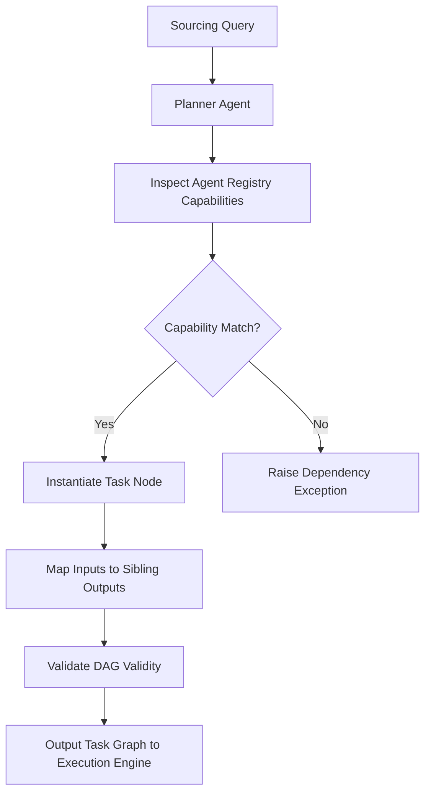

# 1. Planner Agent Deep Dive

The **Planner Agent** is the core cognitive director of ProspectPilot AI. Its primary goal is to translate high-level user objectives (such as "Find funded AI staffing startups in the UK") into an executable, dependency-aware task graph.

---

## 1. Objective and Responsibilities
Unlike simple chatbots that execute a fixed chain of commands, the Planner is designed for **dynamic orchestration**:
1. **Analyze Sourcing Criteria**: Decouple the prompt into target variables (industries, geographic constraints, technical stack keywords, and candidate profiles).
2. **Examine Registry Metadata**: Dynamically inspect the list of active agents registered in the platform and evaluate which capabilities fit the workflow.
3. **Build the Execution Graph (DAG)**: Formulate task nodes that specify target dependencies (parent nodes) and output-to-input parameter mappings.
4. **Avoid Redundant Cycles**: Prevent deadlocks and cyclic references within the task chain.

---

## 2. The Directed Acyclic Graph (DAG) Model
The Planner represents the pipeline as a JSON-compatible collection of `TaskNode` parameters.

### Node Definition
```python
class TaskNode:
    task_id: str          # Unique task identifier
    agent_name: str       # Target agent registered in the Agent Registry
    dependencies: List[str] # Sibling task IDs that must complete first
    input_mapping: Dict[str, str] # Resolves inputs from prior task outputs
```

### Parameter Mapping Syntax
The Planner uses a dot-notated mapping structure (`source_node.output_key`) to link steps:
- **`global.industry`**: Pulls variables directly from the workspace's target configuration.
- **`discovery_task.companies`**: Maps the output array of the discovery agent as input to the validation step.
- **`contact_task.contacts`**: Maps the enriched contact fields to the lead qualification step.

---

## 3. Dynamic Resolution Workflow



### Verification Safeguard
Before exporting the DAG to the execution queue, the Planner runs a sanity check:
- It checks that every dependency declared by a node exists as a preceding node in the graph.
- It verifies that the input mappings match parameters declared in the target agent's `input_schema` Pydantic class.
- If a circular reference is found (e.g., Node A depends on Node B, and Node B depends on Node A), it automatically raises an orchestration error and halts startup.
