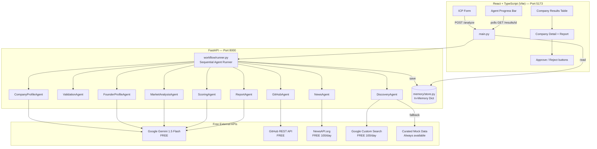

# VenturePilot AI — Architecture (Prototype)

Simple, effective multi-agent system powered entirely by **free APIs**.

---

## System Diagram



---

## Agent Pipeline

```
ICP Input
   │
   ▼
DiscoveryAgent ──── Google CSE → 7-12 candidates
   │
   ▼
ValidationAgent ─── HTTP HEAD check → filtered list
   │
   ├── CompanyProfileAgent ─── scrape + Gemini JSON extract
   ├── FounderProfileAgent ─── Gemini knowledge
   ├── GitHubAgent ─────────── PyGithub stats
   ├── NewsAgent ───────────── NewsAPI + Gemini sentiment
   └── MarketAnalysisAgent ─── Gemini competitive landscape
   │
   ▼
ScoringAgent ──── rubric (team 30% + tech 25% + traction 25% + market 20%)
                  + Gemini rationale text
   │
   ▼
ReportAgent ───── Gemini full Markdown report (9 sections)
   │
   ▼
In-Memory Store → React UI → Human Approval (HITL)
```

---

## Tech Stack

| Component | Technology | Why |
|-----------|-----------|-----|
| LLM | Gemini 1.5 Flash | Free, fast, 1M tokens/day |
| Backend | FastAPI + Uvicorn | Async, auto-docs at /docs |
| Frontend | React + TypeScript + Vite | Fast, type-safe SPA |
| Storage | Python dict (in-memory) | Zero setup, prototype-perfect |
| Orchestration | Python threading | Simple, no framework lock-in |
| Company data | Google CSE + mock | 100 free/day + always works |
| GitHub data | PyGithub | 5000 req/hr free with token |
| News | NewsAPI.org | 100 req/day free |

---

## API Endpoints

| Method | Path | Description |
|--------|------|-------------|
| GET | `/health` | Liveness probe |
| GET | `/docs` | Auto-generated OpenAPI UI |
| POST | `/analyze` | Start workflow (returns job_id) |
| GET | `/results/{job_id}` | Poll status + get companies |
| GET | `/companies` | All companies sorted by score |
| POST | `/approve/{company_id}` | HITL decision |
| GET | `/company/{company_id}/report` | Full Gemini report |

---

## Scoring Rubric

```
Final Score = (Team × 30%) + (Technology × 25%) + (Traction × 25%) + (Market × 20%)

Team      : founder count + IIT/exit signal → 0-100
Technology: GitHub stars + repo activity    → 0-100
Traction  : funding stage + news sentiment  → 0-100
Market    : market_stage from Gemini        → 0-100

Tier: High ≥ 75 | Medium ≥ 50 | Low < 50
```

---

## Frontend Structure (React + TypeScript)

```
frontend/src/
├── App.tsx                     # Router
├── pages/
│   ├── Dashboard.tsx           # ICP form + progress + results table
│   └── CompanyDetail.tsx       # Score, founders, report, HITL panel
├── components/
│   ├── ICPForm.tsx             # Industry, stage, location inputs
│   ├── CompanyTable.tsx        # Sortable scored company list
│   ├── ScoreBadge.tsx          # Green/Yellow/Red tier badge
│   ├── AgentProgress.tsx       # Live step-by-step progress
│   └── HITLPanel.tsx           # Approve/Reject/More Info
├── api/client.ts               # Axios to FastAPI
└── types/index.ts              # Company, ICP, Score TypeScript types
```
