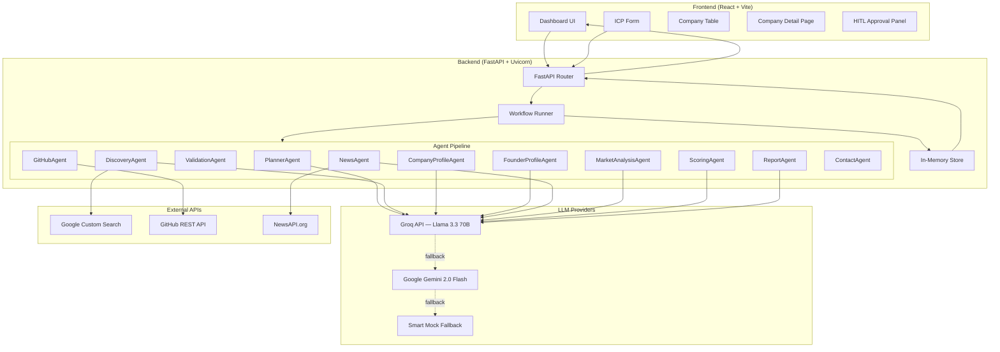
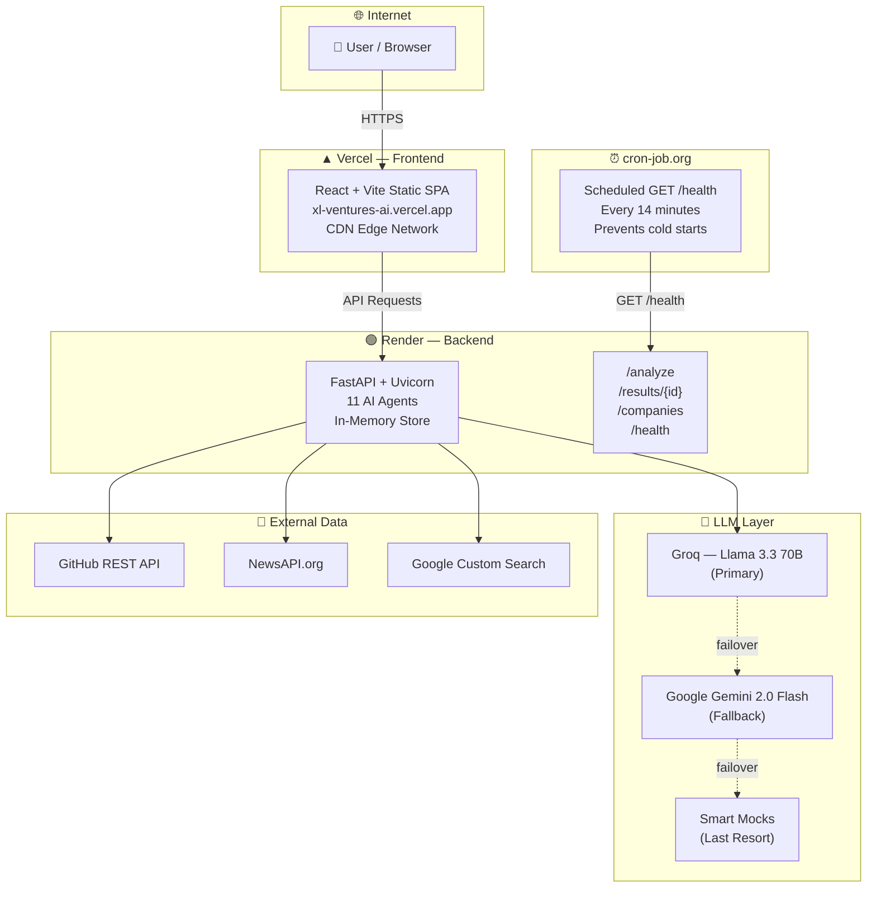

# VenturePilot AI — Architecture Overview

## Introduction

VenturePilot AI is a **multi-agent agentic AI platform** that automates B2B startup discovery and due-diligence for venture capital analysts. The system accepts an Ideal Customer Profile (ICP) from the user, orchestrates a pipeline of 11 specialized AI agents, and produces scored company profiles with full investment reports.

## System Architecture

The platform follows a **3-tier architecture**: a React frontend, a FastAPI backend, and an in-memory data store. All LLM calls are routed through a unified helper module (`llm.py`) that supports Groq (primary) and Gemini (fallback).



## Key Design Decisions

| Decision | Rationale |
|----------|-----------|
| **Sequential agent pipeline** | Simplicity over parallelism for the prototype; agents depend on prior outputs |
| **In-memory store** | Zero database setup; data persists only during the server session |
| **Groq-first LLM routing** | 14,400 RPD free tier vs. Gemini's 20 RPD on GCP sandbox keys |
| **3-tier LLM failover** | Groq → Gemini → Smart Mocks ensures the demo always works |
| **Background threads** | `threading.Thread` for async workflow execution without asyncio complexity |
| **CORS allow-all** | Development convenience; should be restricted in production |

## Data Flow

1. **User** submits an ICP via the React form (industry, stage, location, tech keywords).
2. **FastAPI** receives the POST at `/analyze`, clears the store, creates a job, and launches the workflow in a background thread.
3. **Workflow Runner** chains agents sequentially: Discovery → Validation → Enrichment (Profile + GitHub + News + Market) → Scoring → Report.
4. Each enriched company is saved to the **In-Memory Store** as it completes.
5. **Frontend** polls `GET /results/{job_id}` every 2 seconds until status is `done`.
6. On completion, the frontend fetches `GET /companies` to display the scored pipeline.
7. **HITL Panel** allows the analyst to approve/reject companies via `POST /approve/{id}`.

## Deployment Topology

### Local Development

```
┌─────────────────┐     HTTP      ┌──────────────────────────┐
│  React (Vite)   │ ◄──────────► │  FastAPI (Uvicorn)       │
│  :5173          │               │  :8000                   │
│                 │               │  ├── /analyze            │
│  Dashboard.tsx  │               │  ├── /results/{id}       │
│  CompanyDetail  │               │  ├── /approve/{id}       │
└─────────────────┘               │  └── /health             │
                                  │                          │
                                  │  ┌─ Workflow Runner ───┐ │
                                  │  │  11 Agents Pipeline  │ │
                                  │  │  In-Memory Store    │ │
                                  │  └────────────────────┘ │
                                  └──────────────────────────┘
                                           │
                                           ▼
                              ┌─────────────────────────┐
                              │  External APIs           │
                              │  • Groq (LLM)            │
                              │  • Gemini (LLM fallback) │
                              │  • GitHub API             │
                              │  • NewsAPI                │
                              │  • Google CSE             │
                              └─────────────────────────┘
```

### Cloud Production Deployment

The production deployment uses a **split-tier architecture** across three managed platforms:



| Layer | Platform | URL | Notes |
|-------|----------|-----|-------|
| **Frontend** | Vercel | [xl-ventures-ai.vercel.app](https://xl-ventures-ai.vercel.app/) | Static SPA, CDN-distributed |
| **Backend** | Render | Free Web Service | Auto-sleeps after 15 min inactivity |
| **Keep-Alive** | cron-job.org | `GET /health` every 14 min | Prevents Render cold starts |

## Security Considerations

- API keys are loaded from `.env` via `python-dotenv` and never committed (`.gitignore`).
- CORS is set to allow all origins (`*`) for development — must be restricted in production.
- No authentication layer is implemented in the prototype.
- The in-memory store is ephemeral; no persistent data is stored.
- Render environment variables are configured via the dashboard (never in source code).
