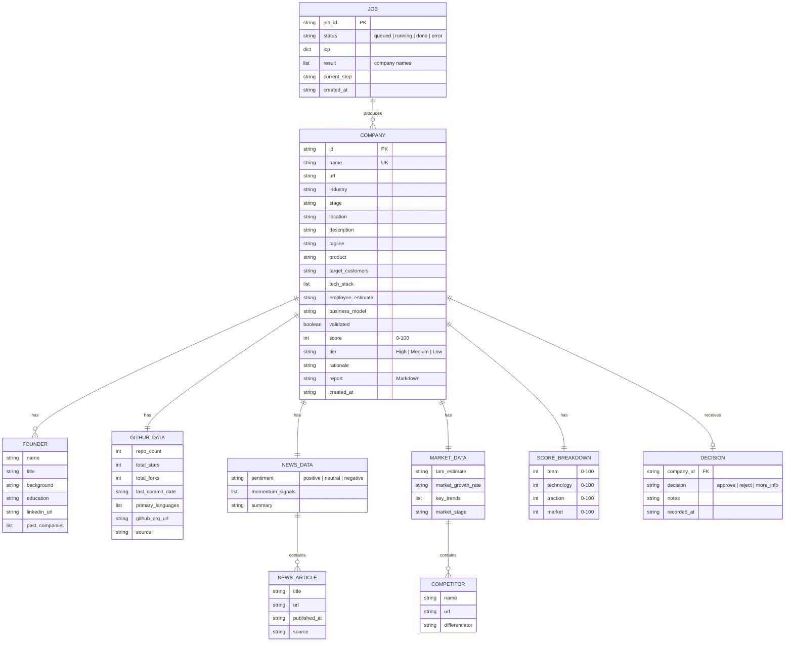

# VenturePilot AI — Data Model

## Overview

VenturePilot AI uses an **in-memory dict-based store** (`src/memory/store.py`) with four top-level collections. All data is ephemeral and resets when the server restarts.

## Entity-Relationship Diagram



## In-Memory Store Schema

The global store in `src/memory/store.py` is a Python dict:

```python
_store: dict = {
    "companies": {},   # name → Company dict
    "reports": {},     # name → Markdown string
    "decisions": {},   # company_id → Decision dict
    "jobs": {},        # job_id → Job dict
}
```

## ICP (Ideal Customer Profile) Schema

The input provided by the user to trigger the pipeline:

```python
class ICPRequest(BaseModel):
    industry: str = "AI Healthcare"
    stage: str = "Seed"
    location: str = "India"
    tech_keywords: list[str] = ["machine learning", "AI"]
```

## TypeScript Interfaces (Frontend)

The frontend mirrors the backend data model via TypeScript interfaces in `frontend/src/types/index.ts`:

| Interface | Key Fields |
|-----------|------------|
| `ICP` | industry, stage, location, tech_keywords |
| `Company` | id, name, url, score, tier, founders, github, news, market, report |
| `Founder` | name, title, background, education, linkedin_url, past_companies |
| `GitHubData` | repo_count, total_stars, total_forks, primary_languages |
| `NewsData` | articles, sentiment, momentum_signals, summary |
| `MarketData` | competitors, tam_estimate, market_growth_rate, key_trends |
| `ScoreBreakdown` | team, technology, traction, market |
| `JobStatus` | job_id, status, current_step, companies |
| `Decision` | `"approve" \| "reject" \| "more_info"` |

## Data Lifecycle

1. **Creation** — `POST /analyze` clears all data and creates a new Job.
2. **Population** — The workflow runner progressively saves companies as they complete enrichment.
3. **Querying** — Frontend polls `/results/{job_id}` and then fetches `/companies`.
4. **HITL** — Analyst decisions are saved via `POST /approve/{company_id}`.
5. **Reset** — Data is wiped on every new analysis run or server restart.
