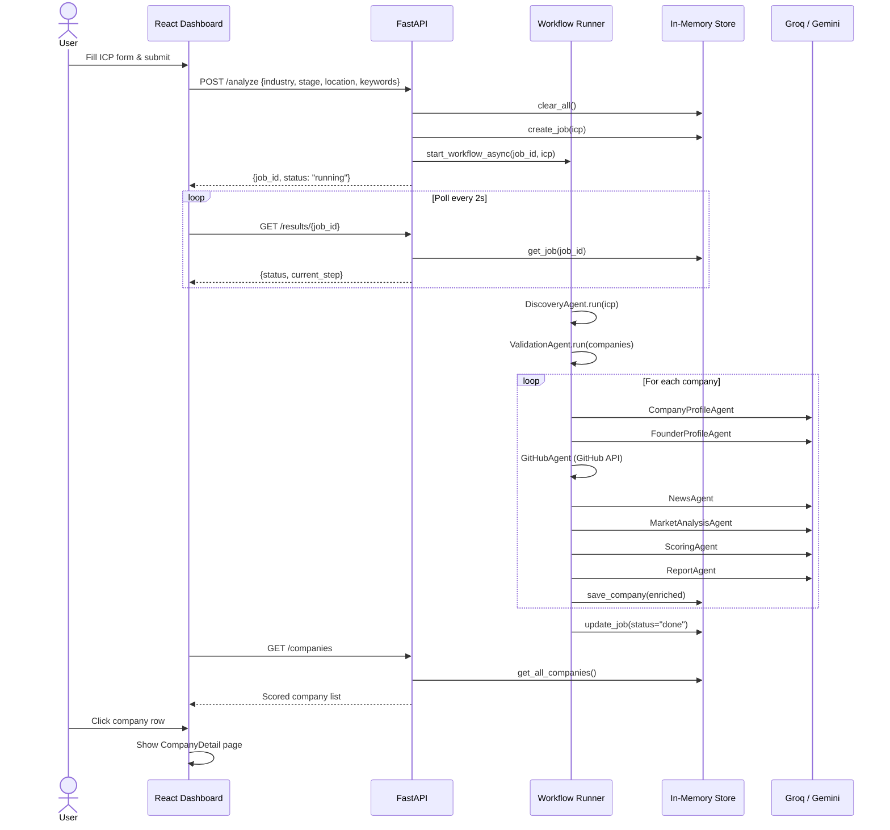
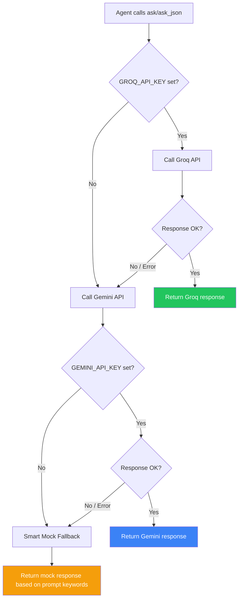
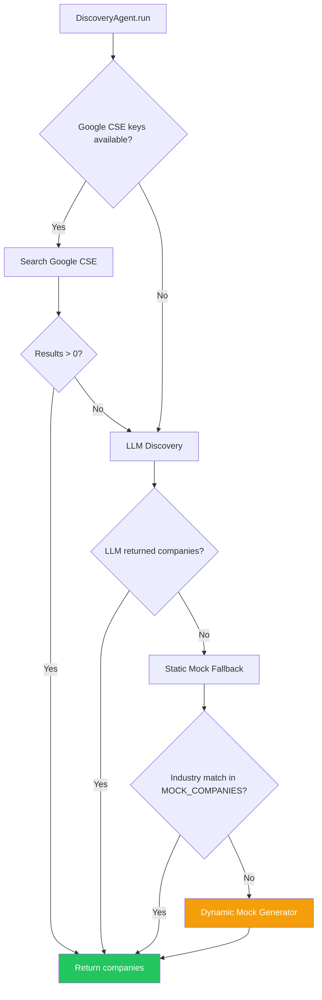
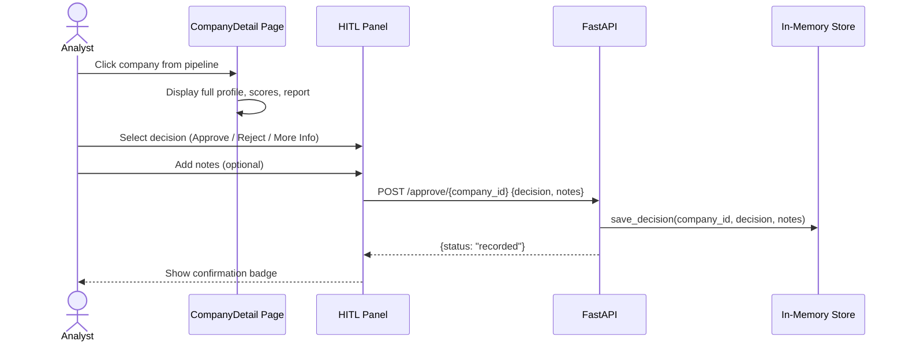
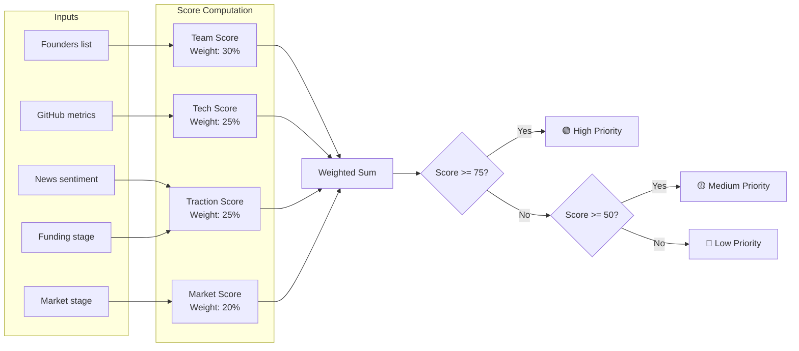

# VenturePilot AI — Sequence & Flow Diagrams

## 1. Main Workflow Sequence

The complete flow from user ICP submission to scored results display:

## 2. LLM Failover Flow

How every LLM call routes through the 3-tier provider chain:

## 3. Discovery Agent Strategy

The three-tier company discovery fallback:

## 4. HITL Approval Flow

Human-in-the-Loop decision workflow:

## 5. Scoring Rubric Flow

How the ScoringAgent computes the 0–100 investment score:

