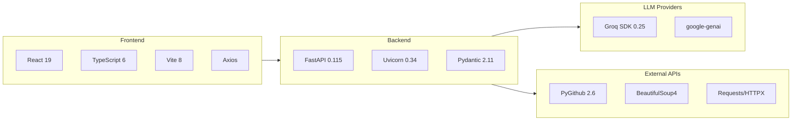

# VenturePilot AI — Tech Stack Summary

## Architecture Layers

## Backend Stack

| Technology | Version | Purpose | License |
|------------|---------|---------|---------|
| [Python](https://python.org) | ≥ 3.11 | Runtime | PSF |
| [FastAPI](https://fastapi.tiangolo.com) | 0.115.14 | REST API framework | MIT |
| [Uvicorn](https://www.uvicorn.org) | 0.34.3 | ASGI server | BSD |
| [Pydantic](https://docs.pydantic.dev) | 2.11.7 | Data validation & serialization | MIT |
| [Groq SDK](https://console.groq.com/docs) | ≥ 0.25.0 | Primary LLM provider (Llama 3.3 70B) | Apache 2.0 |
| [google-genai](https://ai.google.dev/gemini-api) | Latest | Fallback LLM provider (Gemini 2.0 Flash) | Apache 2.0 |
| [PyGithub](https://pygithub.readthedocs.io) | 2.6.1 | GitHub REST API client | LGPL |
| [Requests](https://requests.readthedocs.io) | 2.32.4 | HTTP client | Apache 2.0 |
| [HTTPX](https://www.python-httpx.org) | 0.28.1 | Async HTTP client | BSD |
| [BeautifulSoup4](https://www.crummy.com/software/BeautifulSoup/) | 4.13.4 | HTML parsing & web scraping | MIT |
| [python-dotenv](https://github.com/theskumar/python-dotenv) | 1.1.1 | Environment variable loader | BSD |
| [python-multipart](https://github.com/Kludex/python-multipart) | 0.0.20 | Form data parsing for FastAPI | Apache 2.0 |

## Frontend Stack

| Technology | Version | Purpose | License |
|------------|---------|---------|---------|
| [React](https://react.dev) | 19.2.7 | UI component framework | MIT |
| [TypeScript](https://www.typescriptlang.org) | ~6.0.2 | Type-safe JavaScript | Apache 2.0 |
| [Vite](https://vite.dev) | 8.1.0 | Frontend build tool & dev server | MIT |
| [Axios](https://axios-http.com) | 1.7.9 | HTTP client for API calls | MIT |
| [OxLint](https://oxc.rs/docs/guide/usage/linter.html) | 1.69.0 | Fast JavaScript/TypeScript linter | MIT |

## Development & Testing

| Tool | Version | Purpose |
|------|---------|---------|
| [pytest](https://docs.pytest.org) | 8.4.1 | Test framework |
| [pytest-cov](https://pytest-cov.readthedocs.io) | 6.2.1 | Code coverage |
| [pytest-mock](https://pytest-mock.readthedocs.io) | 3.14.1 | Mocking utilities |
| [Black](https://black.readthedocs.io) | 25.1.0 | Python code formatter |
| [Flake8](https://flake8.pycqa.org) | 7.2.0 | Python linter |

## LLM Provider Comparison

| Provider | Model | Speed | Free Limit | Role |
|----------|-------|-------|------------|------|
| **Groq** | llama-3.3-70b-versatile | ⚡ ~500 tok/s | 14,400 RPD | Primary |
| **Gemini** | gemini-2.0-flash | ~200 tok/s | 20–1,500 RPD | Fallback |
| **Smart Mocks** | N/A | Instant | Unlimited | Last Resort |

## External API Dependencies

| API | Free Tier | Used By | Required |
|-----|-----------|---------|----------|
| [Groq](https://console.groq.com) | 14,400 req/day | All LLM agents | Recommended |
| [Google Gemini](https://aistudio.google.com) | 15 RPM | LLM fallback | Optional |
| [GitHub API](https://docs.github.com/en/rest) | 5,000 req/hr | GitHubAgent | Optional |
| [NewsAPI](https://newsapi.org) | 100 req/day | NewsAgent | Optional |
| [Google CSE](https://developers.google.com/custom-search) | 100 req/day | DiscoveryAgent | Optional |
