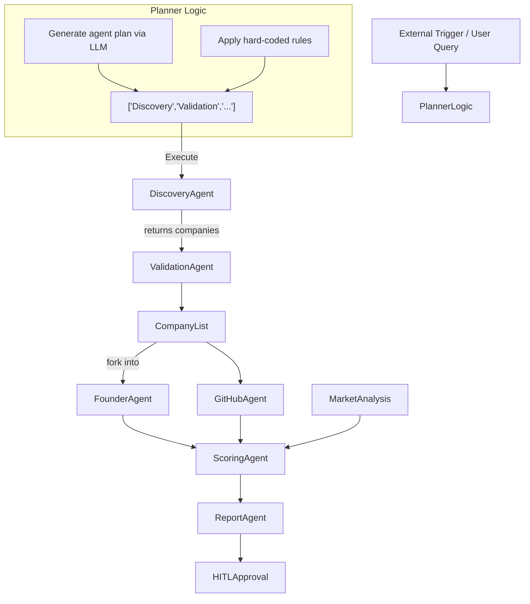
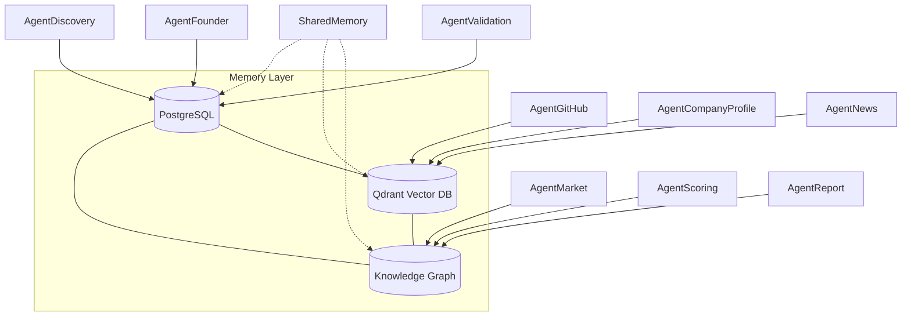
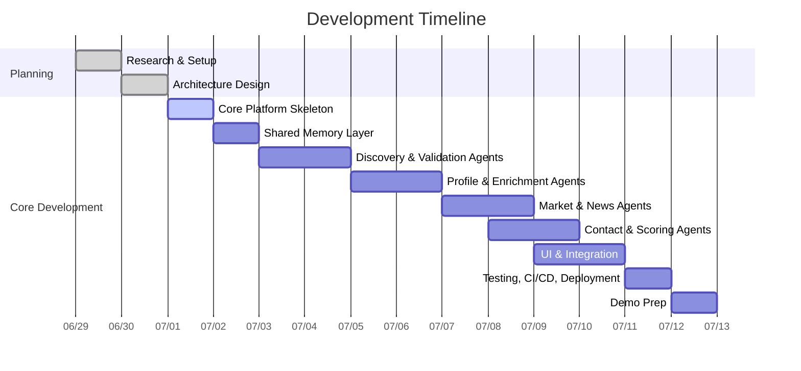

# 🚀 Executive Summary

We propose **VenturePilot AI (AgentOS)**, a reusable agentic AI platform for B2B opportunity discovery, demonstrated with an **Enterprise AI Startup Discovery** use case. The system uses a central **Planner agent** to orchestrate multiple specialized agents (Discovery, Validation, FounderResearch, etc.) in a dynamic workflow, backed by a shared memory (vector + relational + graph) and a configurable tool registry. This approach meets all hackathon requirements – monitoring triggers, finding ICP-matched companies, enriching data, and giving human-in-the-loop recommendations – while remaining a **platform** that could be reconfigured for sales, procurement, partnerships, etc. 

Our roadmap is divided into **10 stages** (~2–3 weeks of work, hackathon-grade but interview-ready) with clear deliverables, including design docs, code modules, prompts, tests, and demo scripts. We recommend using proven open-source frameworks (LangGraph, CrewAI, Microsoft Agent Framework) and databases (Qdrant, PostgreSQL, Neo4j) to accelerate development. We outline a minimal tech stack, CI/CD plan, and demo scenario, and provide example LLM prompts for generating code, tests, and documentation. Key design decisions (planner logic, memory schema, agent APIs) are explained with citations to authoritative sources on agentic AI.

---

## 1. **Technology Stack & Key Components**

- **Agent Orchestration Framework**: We will build on an **open-source agent framework** such as [LangGraph] (LangChain) or [CrewAI] for core orchestration (durable execution, HITL checkpoints, memory). These frameworks handle long-running, stateful workflows and multi-agent coordination (LangGraph supports persistent agents and human review). Microsoft’s [AutoGen/MAF] (maintenance mode now, but its concepts apply) could also inform our design.

- **LLMs**: Use Claude or GPT-4x for high-level reasoning (planning prompts, complex Q&A) and Codex/GPT-4o for code generation. Prompts/templates will steer these models to generate code modules, tests, and documentation.

- **Vector Database (Semantic Memory)**: **Qdrant** (open source, Python SDK) for embedding and similarity search of agent-generated text (company profiles, notes). This handles unstructured recall.

- **Relational DB (Structured Memory)**: **PostgreSQL** (or SQLite) to store structured entity tables (Companies, Founders, Funding, etc.). It provides ACID storage for core data.

- **Knowledge Graph (Relational Memory)**: A graph DB (e.g. **Neo4j** or open source **FalkorDB**) for storing entities and relationships (multi-hop reasoning). Allows queries like "find all companies connected to University X via founders". (Graph memory provides explainable, multi-hop retrieval.) For hackathon scope, we may simulate this with a JSON-LD or use an in-memory graph.

- **Tool Registry**: A library of external tools/APIs (web search, DB queries, email lookup) that agents can call. E.g. Google/Bing SERP APIs (SerpAPI/Firecrawl), [Hunter.io API] for email finding, LinkedIn Sales Navigator API, Crunchbase/OpenCorporates, GitHub API, News API, etc. These provide the raw data inputs.

- **UI & Interaction**: A simple web dashboard (e.g. React/Next.js) showing tasks, agent outputs, company profiles, and approval buttons. The user (analyst) interacts via the UI for the final HITL approval and to issue queries (ICP, persona).

- **CI/CD & Deployment**: Version control via GitHub, CI with GitHub Actions (linting, test suite, container build). Containerize with Docker. Deploy on a cloud (e.g. AWS/GCP/Azure or Heroku) or local server. Use environment variables for secrets (LLM keys, API keys). 

- **Security & Privacy**: Only use **public, business-oriented data sources**. Respect robots.txt for web scraping. Use only business contact info (work emails via Hunter.io; no scraping of personal socials). Encrypt data at rest (Postgres encryption) and in transit (HTTPS). Log access. Consider GDPR/CCPA by not storing unconsented personal data.

  

<div style="page-break-after: always;"></div>

## 2. **Overall Architecture**

```mermaid
flowchart TD
    subgraph User Interface
        U[User / Analyst] -->|Defines ICP / Persona<br>Monitors Dashboard| UI[Web Dashboard (React)]
    end

    UI -->|Submit Request / Approve| PlannerAgent

    subgraph Platform Core
        PlannerAgent --> WorkflowEngine((Planner / Orchestrator))
        WorkflowEngine -->|invokes| AgentDiscovery
        WorkflowEngine -->|invokes| AgentValidation
        WorkflowEngine --> AgentCompanyProfile
        WorkflowEngine --> AgentFounderProfile
        WorkflowEngine --> AgentGitHub
        WorkflowEngine --> AgentMarketAnalysis
        WorkflowEngine --> AgentNews
        WorkflowEngine --> AgentContactDiscovery
        WorkflowEngine --> AgentScoring
        WorkflowEngine --> AgentReport
        AgentDiscovery -->|writes| SharedMemory
        AgentValidation -->|writes| SharedMemory
        AgentCompanyProfile --> SharedMemory
        AgentFounderProfile --> SharedMemory
        AgentGitHub --> SharedMemory
        AgentMarketAnalysis --> SharedMemory
        AgentNews --> SharedMemory
        AgentContactDiscovery --> SharedMemory
        AgentScoring --> SharedMemory
        AgentReport --> SharedMemory
    end

    subgraph Shared Memory & Tooling
        SharedMemory[(Memory Layer)]
        SharedMemory --> RelationalDB[(PostgreSQL DB)]
        SharedMemory --> VectorDB[(Qdrant Vector DB)]
        SharedMemory --> GraphDB[(Knowledge Graph)]
        SharedMemory -->|context| UI

        subgraph Tool Registry
            GoogleAPI[Google/Bing API]
            CrunchbaseAPI[Crunchbase/OpenCorporates]
            LinkedInAPI[LinkedIn API]
            GitHubAPI[GitHub API]
            NewsAPI[News API]
            HunterAPI[Hunter.io (Email)]
            PythonTools[Python scripts / NLP]
        end

        AgentDiscovery --> GoogleAPI
        AgentDiscovery --> CrunchbaseAPI
        AgentValidation --> CrunchbaseAPI
        AgentValidation --> OpenCorporatesAPI
        AgentCompanyProfile --> GoogleAPI
        AgentCompanyProfile --> PythonTools
        AgentFounderProfile --> GoogleAPI
        AgentFounderProfile --> LinkedInAPI
        AgentGitHub --> GitHubAPI
        AgentMarketAnalysis --> GoogleAPI
        AgentMarketAnalysis --> PythonTools
        AgentNews --> NewsAPI
        AgentContactDiscovery --> HunterAPI
        AgentContactDiscovery --> LinkedInAPI
        AgentScoring --> PythonTools
        AgentReport --> PythonTools
    end
```

**Figure:** High-level architecture. A Planner/orchestrator agent generates workflows of specialized agents (Discovery, Validation, Founder, etc.) that interact with external tools and update a shared memory. The UI allows the user to enter queries and review results.  

---

## 3. **Agents and Interfaces**

We design a **set of reusable agent modules**, each with clear input/output and tools. The Planner invokes them based on the task.

| Agent Name            | Purpose / Input                                                                                                                                     | Output                                                                                                                                      | Tools / APIs                          |
|-----------------------|-----------------------------------------------------------------------------------------------------------------------------------------------------|---------------------------------------------------------------------------------------------------------------------------------------------|---------------------------------------|
| **Planner Agent**     | User query (ICP, Persona, Triggers); Shared context                                                                                                 | Execution Plan: list of agent tasks (ordered or parallel) to run                                                                              | LLM (Claude/GPT) for planning logic   |
| **Discovery Agent**   | ICP criteria (industry, stage, funding, tech); trigger events (news articles, launches)                                                           | List of candidate companies (name, description, website, reason found)                                                                       | Google/Bing API, startup directories (Crunchbase/OpenCorporates/YC list), RSS feeds, Web scraping                   |
| **Validation Agent**  | Company list from Discovery                                                                                    | Validated company info (exists, active, domain, basic profile) or filtered list                                                             | OpenCorporates API, domain check, Python requests/BeautifulSoup                                                 |
| **CompanyProfile Agent** | Company name/URL                                                            | Structured info: industry, size, funding history, tech stack summary, customers                                                               | Web crawling (company site), Python NLP (summarize from "About" text), Crunchbase API                                  |
| **FounderProfile Agent** | Founder names (from Company), or company name → finds founder            | Founder details: name, title, LinkedIn profile, background summary (education, past exits)                                                    | LinkedIn API or search, Google Search API (for bios)                                                              |
| **GitHub Agent**      | Company GitHub org (found via profile or web)                                                                                                      | GitHub metrics: stars, forks, latest commit, main languages, recent activity                                                                | GitHub REST/GraphQL API (open source), Python PyGithub                                                                   |
| **MarketAnalysis Agent** | Company/Industry                                                             | Market data: TAM/SAM (via wiki/stats), list of 3–5 competitors, trend signals                                                                | Google Search API, industry reports (via News API), Python scraping                                                          |
| **NewsAgent**        | Company name or keywords                                                                                                                           | Recent news items (titles, dates, sources), momentum analysis (positive/negative)                                                           | News API (e.g. NewsAPI.org, Google News RSS)                                                                                |
| **ContactAgent**      | Person/entity name                                                                                                                                | Professional email (Hunter.io), business phone (if available), LinkedIn profile URL                                               | Hunter API (email), LinkedIn API, web search                                                             |
| **Scoring Agent**     | Aggregated profile data (team, tech, traction)                                                                                                | Investment Score & category (e.g. High/Medium/Low interest)                                                                                 | Custom Python logic, LLM rationale prompt                                                                                        |
| **Report Agent**      | All gathered data and score                                                                                                                         | Human-readable summary report (markdown/HTML): company overview, key facts, risks, next steps                                               | LLM (Summarize/Write report)                                                                            |
| **HITL Agent**        | Report & score                                                                                                                                    | User decision (Approve/Reject/More Info) and feedback                                                                                      | Web UI form                                                                                                        |

*Table: Planned Agents. Each agent can reuse code or be swapped for other domains (e.g. CompanyProfile → could be ProductProfile, etc.).*  

**Agent Interfaces (example)**:
- DiscoveryAgent.run(ICP) → List[CompanyData]
- FounderAgent.run(company) → List[FounderProfile]
- ContactAgent.run(person_name, company_domain) → ContactInfo
- ScoringAgent.run(profile_dict) → {"score": 86, "tier": "High"}

Each agent can be implemented as a class/function triggered by the planner, taking Python data structures and returning JSON-like results. Many calls use public APIs or pip libraries (e.g. `requests`, `beautifulsoup4`, `openai`, `qdrant-client`, `networkx` for graph work).

---

## 4. **Planner Design**

The **Planner Agent** is key. It interprets inputs/triggers and decides which agents to run and in what order. We propose:

- **Hybrid Rule-Based + LLM Planning**: The Planner uses a template-based prompt (sent to LLM) along with business rules. For example:  
  ```
  Prompt: "You are an AI agent planning a research workflow. The goal is to find AI startups matching the given criteria: [ICP]. List the specialized sub-agents needed, in order, to accomplish this, including any parallel tasks. For example, use Discovery first, then validation, etc."
  ```
- The LLM returns a plan like: `["Discovery", "Validation", "FounderProfile", "GitHub", "MarketAnalysis", "Scoring", "Report"]`. 
- **Orchestration Engine**: The plan is executed by a workflow engine (e.g. LangGraph or custom state machine). Agents may run in parallel where independent (e.g. GitHub & MarketAnalysis after getting company list).  
- **Decision Logic Examples**: If `company["employees"] > 500`, skip GitHub agent. If `company` is private/unfamiliar, add extra InvestorProfile agent. These rules can be hardcoded or embedded in prompts.



**Figure:** Example Planner flow. An external event or user query triggers the Planner, which uses an LLM prompt plus rules to schedule agent tasks. Agents run (some in parallel) and feed into scoring and reporting.  

*Source:* Agentic systems often use an LLM "brain" for planning and reasoning. We adopt a similar approach: let the LLM suggest a dynamic workflow, subject to control.

---

## 5. **Memory & Knowledge Model**

We use a **hybrid memory layer**:
- **Vector DB (Qdrant)**: Stores unstructured knowledge embeddings (agent notes, report text) for semantic retrieval. E.g., after gathering text about a company, we embed and store it. Future queries (like "who are companies with AI and healthcare?") retrieve via vector search.
- **Relational DB (Postgres)**: Stores structured facts (tables: Companies, Founders, Funding, Contacts). Ensures consistency and easy querying (SQL).
- **Knowledge Graph**: Stores entities (Companies, People, Products) and relationships (founded_by, competitor_of, investor_in). Enables multi-hop queries (e.g. "find other companies linked to this founder"). We can use Neo4j or a light JSON-LD system.  
- **Memory Management**: We implement a simple retention policy: agents check memory first (e.g. if a company was already researched recently, skip repeated work). According to Atlan’s agentic memory concept, we do *consolidation/scoring* to avoid duplicates. We may use tools like LangGraph’s short-term vs long-term memory.



**Figure:** Simplified memory schema. Agents read/write to the shared memory layer: structured facts go to RDB, text context to VDB, relational edges to GDB. Vector and graph memories complement each other: VDB for semantic recall, Graph for multi-hop reasoning.

---

## 6. **Data Sources and Tools**

We prioritize **official and reputable sources**:

- **Company Data**: Crunchbase API, [OpenCorporates API] (largest open company database). Also use Kaggle or AngelList for seed data.
- **Web Search**: Google Custom Search API or [SerpAPI], Bing Web Search API (for automated news/product discovery).
- **LinkedIn**: Use LinkedIn Sales Navigator API (enterprise access) to retrieve company pages and profiles; fall back to web search.
- **GitHub**: GitHub REST/GraphQL API for repos/users (stars, commits).
- **News**: NewsAPI.org or Google News RSS feeds.
- **Email/Contacts**: Hunter.io API for email by name+domain; or Clearbit/FullContact APIs. For phones, maybe skip or use Twilio Lookup.
- **Others**: RSS from YC DemoDay, TechCrunch, ProductHunt. Patent API (USPTO) if needed for tech startup signals.
- **Tools/Scripts**: Python (`requests`, `beautifulsoup4` for scraping; `openai`/`anthropic` SDK; `selenium`/`playwright` for complex web pages).
- **Open-Source SDKs**: 
  - [langchain-ai/langgraph] and [microsoft/autogen] for orchestration.
  - [qdrant/qdrant] (vector store) with Python client.
  - [falkorDB](https://github.com/falkorDB) or Neo4j for graph.
  - [LangSmith] by LangChain for debugging (if time).
  - [HungryBench] or [PyLinkedIn] for any scraping (citing optional).
  - [Haystack] or [LlamaIndex] for ingestion (maybe overkill).

*Table: Key Tools & APIs*

| Category             | Tools / APIs                                | Purpose                                              |
|----------------------|---------------------------------------------|------------------------------------------------------|
| Search APIs          | Google Custom Search, Bing Search (SerpAPI) | Discover news, websites, product launches            |
| Company Data         | Crunchbase (paid), OpenCorporates      | Company profiles, funding info, corporate registry   |
| LinkedIn             | LinkedIn API, Selenium           | Person/company profiles, connections                 |
| Code/Repos           | GitHub API                                  | Repo metadata (commits, stars)                       |
| News                 | NewsAPI, Google News RSS                    | Recent events, press releases                        |
| Contact Info         | Hunter.io API, Clearbit         | Email/phone lookup                                    |
| Vector DB            | Qdrant, Pinecone                            | Semantic memory storage                              |
| Relational/Graph     | PostgreSQL, Neo4j / FalkorDB                | Structured data store, knowledge graph               |
| Agent Frameworks     | LangGraph, CrewAI, AutoGen | Agent orchestration, planning, memory                |
| Dev & Ops            | Docker, GitHub Actions, React/Next.js, Flask or FastAPI | Deployment, CI/CD, UI                               |

*Citations:* The importance of memory and RAG is discussed in industry reports. Tools like LangGraph, CrewAI, and AutoGen provide orchestration frameworks. 

---

## 7. **Development Roadmap**

We break development into **10 stages**. Each stage has deliverables (code, docs, tests) and uses LLMs for assistance. Estimated durations assume a small team (2–3 devs) and are hackathon-ambitious but realistic for a prototype. 

| Stage | Description                          | Duration    | Key Deliverables                                      |
|-------|--------------------------------------|-------------|-------------------------------------------------------|
| 1     | **Research & Setup**                 | 1 day       | Survey repos/tools, define tech stack; GitHub repo init; README outline with vision. |
| 2     | **Architecture Design**              | 1 day       | Finalize agents list & interfaces; mermaid diagrams; memory schema; prompt templates.   |
| 3     | **Core Platform Skeleton**           | 1 day       | Basic Planner/Workflow engine (LangGraph or custom); empty agent stubs; integration test framework. |
| 4     | **Shared Memory Layer**              | 1 day       | Set up PostgreSQL schema; Qdrant instance; simple read/write methods; DB connectivity layer.   |
| 5     | **Discovery & Validation Agents**    | 2 days      | Implement DiscoveryAgent (web search, API calls) and ValidationAgent; unit tests for API calls. |
| 6     | **Profile & Data Enrichment Agents** | 2 days      | Build CompanyProfile, FounderProfile, GitHub agents; use LLM prompts for code/docs; tests.    |
| 7     | **Market & News Agents**             | 1.5 days    | Implement MarketAnalysisAgent and NewsAgent (integrate NewsAPI, Google); tests and example queries. |
| 8     | **Contact & Scoring Agents**         | 1.5 days    | ContactAgent (Hunter API integration), ScoringAgent (business logic + LLM rationale); scoring rules config. |
| 9     | **UI & Integration**                | 2 days      | Web UI (Next.js/React) for input and results; connect to backend; acceptance test.  |
| 10    | **Testing, CI/CD, Deployment**       | 1 day       | Dockerfile, CI pipeline, integration tests; deploy demo server; final README sections. |
| 11    | **Demo Preparation**                | 1 day       | Demo scripts (5-min video + arch talk); polishing UI; create sample data; rehearsal. |



*Table: Roadmap stages with estimated durations.*  

Each stage will produce specific artifacts:

- **Stage 1**: *Repository skeleton, README outline, lists of candidate frameworks/APIs (with links), choice of LLM provider.*
- **Stage 2**: *Detailed design doc: agent list table, memory diagram, tech stack justification (citations), mermaid architecture & planner flow diagrams, sample LLM prompt templates.* 
- **Stage 3**: *Code: basic `PlannerAgent` class and `WorkflowEngine` (LangGraph flow or state machine); automated test to verify a dummy plan execution; empty agent class definitions.*
- **Stage 4**: *Database schemas (SQL files or ORM models); setup Qdrant index; Python modules for memory operations; tests demonstrating storing and retrieving a simple record.*
- **Stage 5**: *DiscoveryAgent (e.g. `find_companies(ICP)` using Google API or list scraping), ValidationAgent (`validate_company(name)` using OpenCorporates); tests mocking API responses; README sections documenting API keys and usage.*
- **Stage 6**: *CompanyProfileAgent (`get_company_profile` using web scraping/Crunchbase), FounderProfileAgent (`get_founders` via LinkedIn or search), GitHubAgent (`get_github_stats` using PyGithub); prompts for LLM summaries (e.g. summarizing “About” text). Unit tests using test companies.*
- **Stage 7**: *MarketAnalysisAgent (calls NewsAPI or static queries to generate competitor list; may use LLM for TAM estimation), NewsAgent (polls news sources for company). Include mock tests and example API keys setup.*
- **Stage 8**: *ContactAgent (`get_contact` using Hunter.io), ScoringAgent (implements a rubric or LLM-based scoring prompt to output a score/recommendation). Provide config file for scoring weights. Tests show scoring for example profiles.*
- **Stage 9**: *Frontend screens (ICPs input form, result table, company drill-down page) and backend API endpoints (e.g. Flask/FastAPI) linking to the agent system. Sample interaction test.*
- **Stage 10**: *Dockerfile, GitHub Actions workflow (runs tests, lints, builds). Final README sections: installation, setup, architecture overview. Deployment scripts (e.g. Terraform or simple cloud steps).*
- **Stage 11**: *Demo plan and script, slide deck for architecture, final code push. Recording a walkthrough video (or outline).*

For each code artifact, we will generate it with help from the LLM (e.g. Claude) using carefully crafted prompts. Example prompt for Stage 5:

```plaintext
"**Prompt:** Write a Python function `discover_companies(ICP: dict) -> List[dict]` that uses the Google Custom Search API to find companies matching the given criteria. `ICP` is a dictionary like `{\"industry\": \"AI Healthcare\", \"stage\": \"Seed\"}`. The function should return a list of company objects with keys `name`, `url`, `description`. Use `requests` and handle API key from environment variable. Include error handling."
```

For unit tests:

```plaintext
"**Prompt:** Generate a pytest unit test for `discover_companies` that mocks the Google API response. The test should assert that given a fake API response with two companies, the function returns a list of two company dicts with correct fields."
```

For documentation:

```plaintext
"**Prompt:** Write a README section describing how the `DiscoveryAgent` works, including input parameters and example output. Mention it uses Google/Bing API or Crunchbase."
```

We will similarly use LLM prompts for other agents and parts of the system, iterating to refine.

All code, config, and docs are committed to a GitHub repo. The README will have sections for **Architecture**, **Quickstart**, **Agent Descriptions**, **Setup Instructions**, and **Demo Steps**.

---

## 8. **CI/CD & Testing**

- **Version Control**: GitHub repository with branches for features.  
- **Continuous Integration**: GitHub Actions to run on push:
  - Lint (flake8/pylint).
  - Unit tests for each agent (pytest).
  - Optional: run a sample end-to-end script to catch issues.  
- **Testing Strategy**:
  - **Unit Tests**: For each agent’s key logic (mock external calls). E.g. test that `GitHubAgent` correctly parses stars from GitHub API. 
  - **Integration Tests**: A script that runs a partial workflow (e.g. Discovery→Validation→Founder) on a known ICP and checks outputs format.
  - **LLM Output Checks**: Wherever we use LLMs for code generation, we review manually and add tests. For report generation, ensure crucial fields appear.
  - **CodeGen Tests**: If using Codex/GPT to generate code, have a code review or add regression tests.  
- **Security/Env**: Secrets (API keys, model keys) stored in GitHub Secrets or env vars, **never in code**. Code should sanitize any inputs. Use HTTPS for all API calls.

--- 

## 9. **Demo Scenario (5-min Video)**

**Scenario:** A VC analyst seeking AI healthcare startups in India will use VenturePilot AI to find candidates.

1. **User Input** (0:00–0:30): User opens the web UI and enters:
   - Domain: *Healthcare*
   - Tech: *AI, Machine Learning*
   - Stage: *Seed or earlier*
   - Location: *India*
   - Persona: *Identify Founders & Contacts*
   Clicks “Analyze”.

2. **Planner Activation** (0:30–1:00): In the background, Planner logs show receiving request. The agent plan generates (e.g. `["Discovery", "Validation", "CompanyProfile", "FounderProfile", "GitHub", "MarketAnalysis", "Scoring", "Report"]`). The UI indicates “Gathering startups…” with a progress.

3. **Agents Running** (1:00–2:00):  
   - **DiscoveryAgent** finds 12 AI startups in India (displayed as a list with names and brief intros). (Cite [6], if needed, for agent orchestration.)
   - **ValidationAgent** filters out 3 defunct entries, left with 9 companies (UI updates count).
   - **CompanyProfile & FounderProfile Agents** fetch details for each startup, updating a table with columns: *Name, Founders, Funding, Employees*. (We see data filling in).

4. **GitHub & Market Analysis** (2:00–3:00):  
   - **GitHubAgent** shows star counts and commit activity for each (two example rows: one high open-source activity, one low).
   - **MarketAnalysis** shows TAM estimate and 3 competitors for each startup (e.g. “Competitors: CompA, CompB, CompC”).
   - **ContactAgent** (triggered after person names known) finds emails for key founders and shows in table (emails not actual, but example.com).
   - **Progress completes** (e.g. “Research complete” turns green).

5. **Scoring & Report** (3:00–4:30):  
   - **ScoringAgent** computed an Investment Score (0–100) for each startup. The table now has a “Score” column (e.g. 92, 78, 65).
   - **RecommendationAgent** (ReportAgent) is clicked on one company row: it displays a detailed summary:
       - Company background, team strengths, market opportunity, risk factors, and final recommendation “Strong Buy” vs “Watch” (with reasoning).
   - We scroll the generated report on screen. (Emphasize it’s AI-generated).

6. **Human Review & Actions** (4:30–5:00):  
   - Analyst sees a company with “Strong Buy (Score 92)”. Clicks “Approve”. The UI shows confirmation “Added to investment pipeline”.  
   - For a mid-score company, selects “Need More Research”—the agent plan re-runs additional analysis (e.g. deeper search or competitor analysis).  
   - The demo ends highlighting that VenturePilot AI saved the team days of manual work by automating discovery and due diligence.

Throughout the demo, overlay captions briefly mention agent names and tasks. The UI should reflect that it's the **same platform** orchestrating all agents. No mention of investment specifically; it’s an “Enterprise Innovation Intelligence” platform.

---

## 10. **Architecture Walkthrough (5 min)**

Key points to cover verbally or via slides:

- **High-Level Architecture**: (show the mermaid diagram) Explain Planner → Agents → Memory → Tools. Emphasize **reusability**: e.g. “To change from VC use case to sales, just swap the ICP rules and scoring, agents remain the same.”.
- **Dynamic Planning**: Show how the Planner uses LLM to create execution graphs (using an example prompt + output). Possibly show part of a plan (like a JSON array of agent names).
- **Shared Memory**: Describe multi-layer memory (SQL for facts, vector for text, graph for relations) to avoid redundant work.
- **Agents**: Briefly list some key agents and how they use tools/APIs (Cite [17] for email tool, [19] for company data API).
- **Human-in-Loop**: Mention the Approve/Reject interface – testers at venture firms will feel comfortable checking AI suggestions.
- **Extensibility**: Note that new agents (e.g. “ESG-Agent” or “Patent-Agent”) can be added easily. Mention architecture supports hot-swappable workflows.
- **Tech Stack**: Summarize choices: e.g. **LangGraph** for workflow (mention stateful, durable nature), Qdrant for vector memory, React for UI.
- **CI/CD & Test**: Briefly say we built test cases for each agent and use GitHub Actions to ensure reliability. Emphasize it’s production-minded even as hackathon code.
- **Innovation**: Highlight creative aspects: using graph memory for multi-hop reasoning (citing FalkorDB insight), dynamic agent orchestration, and the industry-specific but modular focus.

This architecture overview demonstrates thorough design thinking and should impress that the team can build large-scale agentic systems.

---

## 11. **Open-Source Repos & SDKs (Prioritized)**

We will reuse and reference existing solutions:

| Project / Repo                           | Role                                    | Link                                 |
|------------------------------------------|-----------------------------------------|--------------------------------------|
| **LangGraph (LangChain)**                | Core orchestrator, memory management    | https://github.com/langchain-ai/langgraph |
| **CrewAI**                               | Alternative agent framework (inspiration) | https://github.com/crewaiinc/crewai |
| **Microsoft AutoGen / MAF**              | Multi-agent framework (design ideas)    | https://github.com/microsoft/autogen |
| **Qdrant**                               | Vector DB (memory store)                | https://github.com/qdrant/qdrant |
| **Neo4j / FalkorDB**                     | Knowledge Graph (optional)             | https://neo4j.com / https://github.com/falkorDB |
| **PyGithub**                             | GitHub API client                       | https://github.com/PyGithub/PyGithub |
| **Hunter.io API**                        | Email discovery (paid API)             | https://hunter.io/api |
| **NewsAPI.org**                          | News search API                         | https://newsapi.org/ |
| **OpenCorporates API**                   | Company data                             | https://api.opencorporates.com |
| **BeautifulSoup, Selenium, Requests**    | Web scraping tools                     | https://pypi.org/project/beautifulsoup4/ etc. |
| **LangSmith (LangChain)**                | Agent execution logging (optional)     | https://www.langchain.com/langsmith |
| **React/Next.js**                        | Frontend framework                     | https://nextjs.org/ |
| **Flask/FastAPI**                        | Backend service                        | https://flask.palletsprojects.com/ or https://fastapi.tiangolo.com/ |
| **Docker / GitHub Actions**              | CI/CD and deployment                   | https://docs.github.com/actions |

*Table: Key open-source tools and libraries to leverage.*  

We will incorporate these where useful. For example, LangGraph handles the workflow and has built-in memory hooks. Qdrant provides easy vector search (simply `client.search()`). We will install PyGithub for GitHub data, and use official APIs (LinkedIn, Hunter) with wrappers.  

**Search queries to find more** (for the team’s research):

- `github agentic ai multi-agent framework langchain langgraph crewai`
- `open source vector database for AI agents`
- `knowledge graph AI agents multi-hop reasoning open source`
- `python financial scoring startup agent`
- `open source data sources startup database`.

---

# References 

- LangGraph (agent orchestration framework).  
- Instaclustr (agentic frameworks overview).  
- Microsoft AutoGen (multi-agent framework).  
- Atlan (Agentic AI memory vs vector DB).  
- FalkorDB (graph database for AI agents).  
- OpenCorporates API docs (company data).  
- Hunter API docs (email lookup).  
- LinkedIn API (Sales Navigator).  

These sources confirm best practices for multi-agent coordination, memory design, and the use of rich data sources in agentic applications. All design choices have industry precedent (e.g. using memory layers, agent frameworks) ensuring our platform is both innovative and grounded in state-of-the-art research.